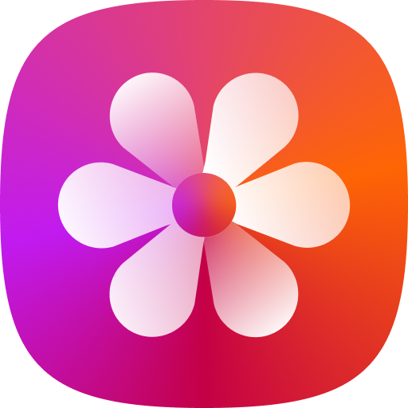
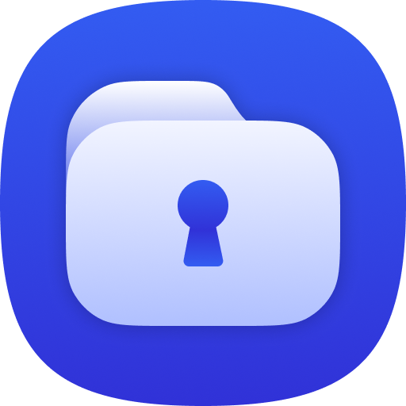
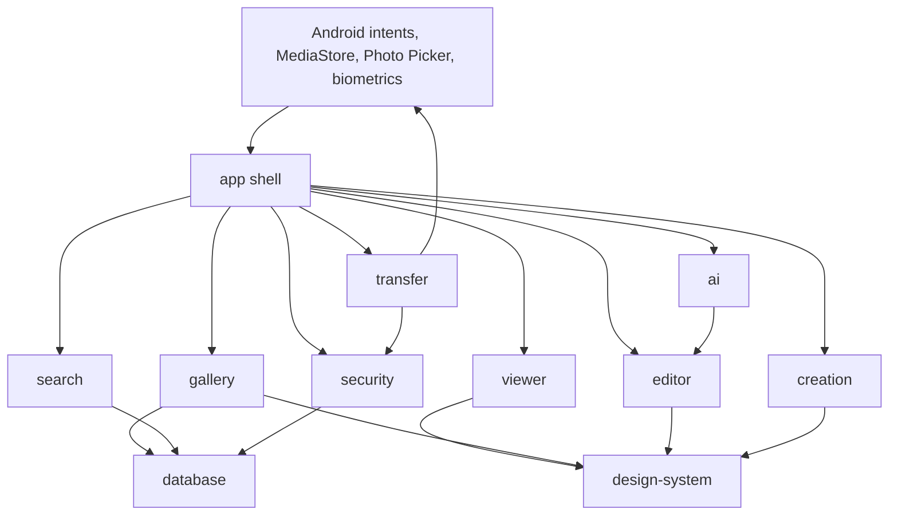
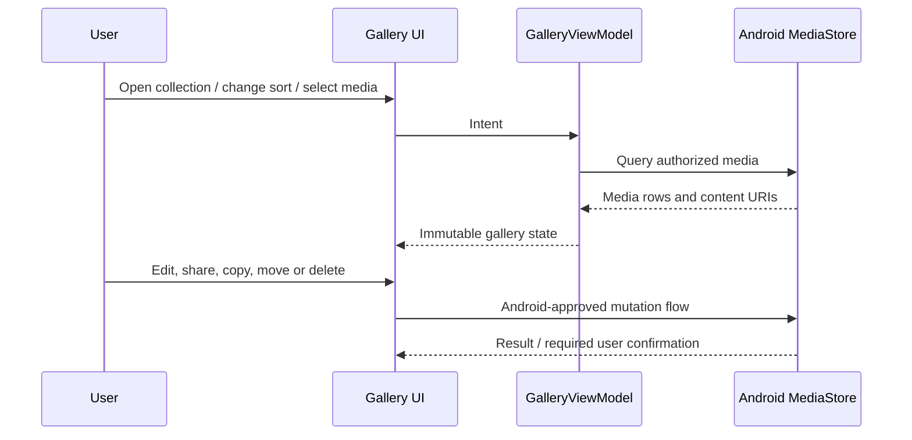
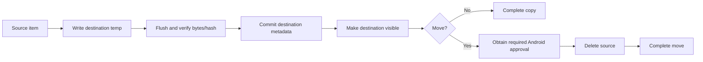

<div align="center">
  <picture>
    
  </picture>

  # Vault Gallery

  ### A local-first, flagship-focused Android gallery with a full private gallery built in

  **Version 1 · The only public release line**

  [](https://github.com/danyalwg/VaultGallery/releases/tag/v1.0.0)
  [](#requirements)
  [](#technology)
  [](#technology)
  [](#privacy-model)
  [](#verification)

  [Download Version 1](https://github.com/danyalwg/VaultGallery/releases/tag/v1.0.0) ·
  [Explore the product](https://danyalwg.github.io/VaultGallery/) ·
  [Installation](#installation) ·
  [Features](#what-vault-gallery-does) ·
  [Security](#secure-gallery) ·
  [Build](#building-from-source)
</div>

---

> [!IMPORTANT]
> Vault Gallery Version 1 is a flagship-phone evaluation build. The downloadable APK is
> debug-signed and ARM64-only. Keep an independent backup of irreplaceable media. Read
> [Known limitations](KNOWN_LIMITATIONS.md) and [Security](SECURITY.md) before treating any
> application-level vault as the only copy of private data.

## Why this project exists

Moving from an OEM gallery to another Android phone should not mean losing the interaction quality
that made the original device comfortable: a dense but readable timeline, predictable albums,
finger-following media paging, a centre-anchored filmstrip, real-time video scrubbing, useful local
editing, deliberate copy and move operations, and a private gallery that behaves like a gallery—not
like a file locker bolted onto one.

Vault Gallery is built around that premise. It combines a complete public gallery and a parallel
Secure Gallery with the same browsing, album, viewing, editing, creation, sorting, search and
metadata concepts. Its design is deliberately media-first, dark, touch-oriented and optimized for
modern flagship Android hardware.

This repository contains the Android application, shared feature modules, automated tests, bundled
on-device model declarations, security and storage documentation, and the interactive project site.
There is one public product identity and one release line: **Version 1**.

## At a glance

| Area | What Version 1 provides |
|---|---|
| Gallery | Date-grouped media timeline, album browsing, semantic album zoom, stories, search, favourites, locations, recent media and recycle bin |
| Navigation | Four-surface gallery navigation, contextual overlays, remembered destination, remembered grid density and responsive phone layouts |
| Gestures | 3–12-column anchored pinch reflow, press-and-slide range selection, finger-following viewer paging, pinch zoom, swipe-up information and centre-anchored filmstrip navigation |
| Video | Inline playback, mute state, play/pause, precise scrubbing, filmstrip navigation, rotation, snapshot, external playback and full editor handoff |
| Photos | Crop, rotate, flip, straighten, perspective, tones, filters, drawing, text, stickers, mosaic, local adjustments, curves, LUTs, lens correction and metadata-aware export |
| AI-assisted tools | Local object/person/background selection, neural content-aware fill, portrait/background effects, OCR and deterministic enhancement tools with explicit backend labels |
| Documents | OCR overlay, copyable text, corner detection, movable quadrilateral crop, inspection loupe and document tone cleanup |
| Creation | Collage, GIF, mixed-media movie, slideshow, album creation and configurable output controls |
| Secure Gallery | Four-digit PIN, biometric unlock, encrypted or locked-only storage, matching gallery/editor UX, secure albums, recycle bin, controlled export and per-app media access |
| Transfers | Durable foreground copy/move/import/export jobs with progress, pause, resume, cancel, retry and destination verification before source deletion |
| Android integration | Gallery launcher, photo/video viewer and editor, modern/legacy camera review, media collection intents and legacy picker contracts |
| Privacy | Local-first browsing and processing, no account requirement, no analytics SDK and no default cloud upload |

## What Vault Gallery does

### Pictures timeline

- Groups photos and videos by date without converting the library into a file-manager screen.
- Supports 3 through 12 columns with continuous pinch feedback and anchored reflow.
- Keeps the media beneath the pinch visually stable while neighboring items rearrange.
- Allows long-press-and-drag range selection, including reverse selection and edge scrolling.
- Filters by media type, favourites, album, virtual collection and indexed search result.
- Remembers the chosen grid density and last useful gallery destination.
- Uses MediaStore as the public-library source of truth instead of inventing a shadow copy.

### Albums

- Pins navigation-sensitive albums such as Camera ahead of ordinary alphabetical results.
- Supports physical albums, merged same-name albums, smart albums and user album groups.
- Switches between album grid and album list through semantic pinch zoom.
- Allows whole-album selection and routes album operations as albums, not as an unexplained list of
  individual files.
- Supports configurable album covers, essential-album membership, sorting and album creation.
- Preserves source folder names when media crosses the public/Secure Gallery boundary.
- Merges into an existing destination folder when names match and creates the folder when they do
  not.

### Media viewer

- Opens the exact ordered collection the user came from. Opening an item from All pictures keeps the
  All pictures ordering; opening from an album stays inside that album.
- Pages between photos and videos with a direct-manipulation transition that follows the finger.
- Distinguishes image panning from media paging so zoomed content does not accidentally change item.
- Supports photo pinch zoom and video zoom without losing navigation context.
- Uses an anchored bottom filmstrip: the centre is the active item and the content moves beneath it.
- Shows video identity and duration in the filmstrip rather than presenting every item as an
  indistinguishable frame.
- Reveals metadata and contextual information with a finger-following upward gesture.
- Can force the viewer UI into portrait or landscape independently of the device rotation lock.
- Hides and restores chrome by tapping without burying the primary playback control.

### Video playback

- Plays inline inside the gallery and also exposes an external-player route.
- Keeps play/pause state and scrub state separate: dragging a playing video does not silently turn
  it into a paused video.
- Uses low-latency seeks while the finger moves and performs one exact seek when the gesture ends.
- Updates elapsed time and the centre playhead from display-frame progress.
- Supports mute/unmute, replay, snapshot, orientation, details, sharing, editing and next/previous
  navigation.
- Uses the same interaction model for public and Secure Gallery video playback.
- Exposes selected locked-only secure media to explicitly approved external applications through a
  narrow URI grant instead of globally publishing the private library.

### Photo editor

The editor is organized as a visual workspace rather than a collection of placeholder buttons.
Operations retain a responsive preview while full-resolution rendering and encoding happen away
from the main thread.

- Free and fixed-ratio crop
- Movable crop edges and corners
- Rotate and flip
- Straighten
- Horizontal and vertical perspective correction
- Exposure, contrast, highlights, shadows, saturation, warmth, tint and sharpness controls
- RGB and per-channel curves
- Selective HSL color editing
- Importable `.cube` LUTs with live strength
- Local brush, radial and gradient adjustments
- Lens distortion and vignette correction
- Drawing, highlighter and eraser
- Text, stickers, shapes and badges
- Mosaic painting with multiple styles
- Reorderable vector layers with visibility, locking, opacity and blend modes
- JPEG, PNG, WebP, HEIC and AVIF export when supported by the device
- RAW preview ingestion, color-space-aware buffers and Ultra HDR gain-map preservation paths
- Save copy and replace flows that refresh MediaStore accurately
- Undo/redo for supported operations
- Press-and-hold before/after comparison in AI-assisted tools

### Video editor

- Independent trim handles with a real transport playhead
- Real-time timeline seeking that preserves playback state
- Movable eight-handle crop frame
- Rotation and output sizing
- Speed and mute controls
- Looks and tone controls
- Subtitle panel and configurable composition metadata
- Undo/redo
- Save copy or replace source
- Device-aware output estimates
- Cancellation and explicit failure reporting instead of a silent partial file

### AI-assisted studio

“AI” is not used as a decorative label. Version 1 identifies the backend behind each tool and keeps
neural and deterministic processing distinguishable.

- MediaPipe-assisted interactive object selection
- ML Kit person/background segmentation
- Editable Add, Subtract and Lasso mask refinement
- Edge-aware probability-mask refinement for hair, clothing, hands and object boundaries
- Local Big-LaMa ONNX content-aware reconstruction
- Object erase, cutout, isolation, blur, relight and background treatments
- Portrait and background effects through shared refined masks
- Fast bounded preview followed by full-quality Apply
- Outside-mask preservation when reconstructing selected regions
- Local inference with NNAPI, XNNPACK and CPU fallback
- Memory-mapped model loading to avoid creating a second 200 MB model copy in app storage
- Model identity, checksum, source and licence metadata in
  [`model_licenses.json`](app/src/main/assets/model_licenses.json)

The bundled neural model is useful, not magical. Repeated structures, text, faces at a removal edge,
very large masks and selections without surrounding context can still produce artifacts. The editor
surfaces those boundaries instead of pretending every result is generative perfection.

### Document tools and OCR

- Detects document-like content and exposes a contextual text action.
- Runs on-device OCR and renders selectable text over the image.
- Copies recognized text without uploading the image.
- Detects a four-corner document quadrilateral.
- Allows manual corner correction.
- Shows a magnified inspection loupe while a corner is moved.
- Applies perspective correction into a flattened document.
- Provides document-oriented tone and cleanup choices.
- Keeps scan/crop inside the editor instead of unexpectedly launching the camera.

### Create tools

| Tool | Controls |
|---|---|
| Collage | Layout templates, slot ordering, spacing, border, background, ratio, per-slot positioning, overlays and export |
| GIF | Source order, frame timing, loop behavior and output generation |
| Movie | Mixed photos/videos, clip order, duration, ratio, resolution, crossfades, titles and optional background audio |
| Slideshow | Ordered media playback with gallery-native navigation |
| Album | Existing destination, create-or-merge destination and predictable folder naming |

Create actions are available from relevant collections and album contexts. Secure creation keeps
intermediate media within authenticated application flows and reports cancellable progress.

### Search and organization

- Filename, album and media-type filtering
- Local OCR/tag index
- Favourites and recent media
- Smart albums defined by type, date, folder, filename, favourite state, duration, size and indexed
  text
- Exact-duplicate detection with conservative keeper recommendations
- Quality-review categories that never auto-delete media
- Local visual-similarity descriptors and a replaceable SQLite vector index
- Burst grouping and best-shot recommendations
- Location-based presentation when location metadata exists

### WhatsApp and WhatsApp Business

Vault Gallery can preserve WhatsApp’s normal physical folders or present a conversation-oriented
virtual organization when a compatible local backup and user-supplied backup key are available.

- WhatsApp and WhatsApp Business are separate sources.
- Media can be shown by chat without physically moving it into nested folders.
- Images, videos and other recognized visual media from one contact/chat stay together.
- The user can switch back to the original WhatsApp folder organization.
- The gallery never reorganizes or renames WhatsApp’s owned files merely to change presentation.
- When message-to-file matching is unavailable, the app falls back to the original folders.

## Secure Gallery

<div align="center">
  
</div>

Secure Gallery is designed as the same gallery experience behind an authentication boundary—not as
an impoverished second application. It shares the browsing, albums, viewer, filmstrip, gestures,
sorting, editing, creation, search and metadata concepts of the public gallery, then adds controls
that only make sense for private media.

### Authentication

- Four-digit PIN
- Automatic submit as soon as the correct fourth digit is entered
- Native Android biometric prompt
- Android Keystore-wrapped vault key
- Configurable locking policy
- Explicit Lock action
- Authentication-gated secure routes
- Neutral task identity and lifecycle obscuring

### Storage modes

**Encrypted mode** encrypts media at rest and decrypts only through authenticated flows. This is the
stronger confidentiality option, but external applications cannot directly consume encrypted bytes.

**Locked-only mode** keeps ordinary media files outside MediaStore behind the gallery’s lock,
`.nomedia`, controlled navigation and a per-application access list. It is faster and compatible with
approved players, but it is not cryptographic protection against filesystem access.

The user can convert storage modes deliberately. Conversion is a foreground, recoverable operation;
it must not destroy the only verified copy before the destination is complete.

### Moving between public and secure storage

- Copy or true move in either direction
- Individual media, groups and whole albums
- Source album name preserved automatically
- Same-name destinations merged automatically
- New destination folders created when necessary
- Source deletion only after destination bytes and metadata are verified
- Background execution through WorkManager
- Notification progress with percentage and item counts
- Pause, resume and cancel controls
- Retry-safe checkpoints
- Transfer report for partial failures

### Data survival

Secure media is stored in a user-owned persistent area under
`Documents/VaultGallery/SecureVault`, so uninstalling the APK does not intentionally delete the media
payload. Application preferences and allow-lists can still be removed by uninstall, which is why
recovery material and an independent backup remain essential.

Read the complete documents:

- [Secure Gallery behavior](SECURE_GALLERY.md)
- [Secure file format](SECURE_FILE_FORMAT.md)
- [Key management](KEY_MANAGEMENT.md)
- [Threat model](THREAT_MODEL.md)
- [Security policy and disclosure](SECURITY.md)

## Android system integration

Version 1 advertises the standard Android contracts available to a third-party gallery:

- `CATEGORY_APP_GALLERY`
- Image and video `ACTION_VIEW`
- Image and video `ACTION_EDIT`
- Android 10+ `MediaStore.ACTION_REVIEW`
- Legacy camera review
- Image/video collection viewing
- Legacy `ACTION_PICK`
- Legacy `ACTION_GET_CONTENT`
- Single and multiple result delivery with URI read grants

Android deliberately keeps default-app selection under user control. Vault Gallery cannot silently
make itself the default on every phone. After installation, open:

1. **Vault Gallery → Menu → Settings → System integration**.
2. Tap **Open photos**.
3. Choose **Vault Gallery** and **Always**.
4. Repeat for **Open videos**.

Some OEM camera and file-manager applications use embedded or private viewers and may not consult
third-party handlers.

## System behavior and accessibility

Vault Gallery follows real Android-wide configuration where Android provides it:

- System typeface
- Font scaling
- Bold-text/font-weight adjustment
- Display scaling
- Locale
- Right-to-left layout direction
- Keyboard resizing
- System animation scale and reduced-motion behavior
- Android permission and biometric surfaces

Android has no universal device-wide photo sort preference. Sort order, grid density and gallery
destination are therefore remembered by Vault Gallery for the surface where the choice is meaningful.

Touch targets, text alternatives, logical semantics and responsive layout remain active engineering
concerns. See [Known limitations](KNOWN_LIMITATIONS.md) for the current certification boundary.

## Privacy model

Vault Gallery is local-first:

- No account is required.
- No advertising SDK is included.
- No analytics SDK is enabled.
- Public browsing reads user-authorized MediaStore content.
- OCR, segmentation, similarity and content-aware fill run on the device.
- The app does not upload the library by default.
- Secure metadata is not intentionally written into the public media index.
- Sharing private content is explicit and uses narrow, temporary URI grants.

Network permission exists for explicit network-capable dependencies and future/user-triggered flows;
it is not permission to upload a library. Review [PRIVACY.md](PRIVACY.md) for the data model and
[THREAT_MODEL.md](THREAT_MODEL.md) for attacker assumptions.

## Installation

### Requirements

- Android 10 / API 29 or newer
- ARM64 (`arm64-v8a`) device
- A modern flagship-class phone is recommended
- Sufficient free space for the APK, on-device models, editing caches and exports
- Permission to install apps from the browser/file manager used to download the APK

### Install the APK

1. Open the [Version 1 release](https://github.com/danyalwg/VaultGallery/releases/tag/v1.0.0).
2. Download `VaultGallery-v1.0.0-arm64.apk`.
3. Compare its SHA-256 with `SHA256SUMS.txt` from the same release.
4. Open the APK on the Android device.
5. Approve installation from that source if Android asks.
6. Launch **Gallery** and grant the media scope you want it to display.
7. Launch **Secure Gallery** separately and complete PIN/biometric setup if desired.

### Install with ADB

```bash
adb install -r VaultGallery-v1.0.0-arm64.apk
```

`-r` performs an in-place upgrade and preserves application data. Do not uninstall as an upgrade
strategy when private-state preferences matter. Always keep an independent media backup.

### Verify the file

PowerShell:

```powershell
Get-FileHash .\VaultGallery-v1.0.0-arm64.apk -Algorithm SHA256
```

Linux/macOS:

```bash
sha256sum VaultGallery-v1.0.0-arm64.apk
```

The expected digest is published in the GitHub release and in [Build status](BUILD_STATUS.md).

## Building from source

### Toolchain

- Git with Git LFS
- Android Studio with Android SDK 35
- JDK 17 (Android Studio’s bundled JBR works)
- PowerShell, Bash or another terminal capable of running the Gradle wrapper

The neural model and interactive segmentation model are stored through Git LFS. A source checkout
without LFS objects will not reproduce the packaged app correctly.

```bash
git lfs install
git clone https://github.com/danyalwg/VaultGallery.git
cd VaultGallery
git lfs pull
```

Create `local.properties` if Android Studio does not create it automatically:

```properties
sdk.dir=/absolute/path/to/Android/Sdk
```

Build the debug APK:

```bash
./gradlew :app:assembleDebug
```

Windows:

```powershell
.\gradlew.bat :app:assembleDebug
```

Output:

```text
app/build/outputs/apk/debug/app-debug.apk
```

Run the local release gate:

```bash
./gradlew :app:testDebugUnitTest :app:lintDebug :app:assembleDebug
```

Compile connected tests:

```bash
./gradlew :app:assembleDebugAndroidTest
```

Run the system-integration test on a connected device:

```bash
adb shell am instrument -w -r \
  -e class com.danyal.vaultgallery.SystemIntegrationInstrumentedTest \
  com.danyal.vaultgallery.debug.test/androidx.test.runner.AndroidJUnitRunner
```

The release build is intentionally unsigned in source control. Never commit a production keystore,
password, signing properties or recovery secret.

## Project architecture



### Gradle modules

| Module | Responsibility |
|---|---|
| `app` | Activities, application wiring, Android intent contracts and product-level navigation |
| `design-system` | Color, shape, typography, spacing and motion tokens shared by public and secure experiences |
| `database` | Persistent indexes and database-oriented infrastructure |
| `security` | Authentication, secure storage contracts, access control and encrypted metadata concerns |
| `gallery` | Public and secure collection-domain concepts |
| `viewer` | Media viewing, paging, zoom and playback interaction primitives |
| `editor` | Photo/video editing contracts and shared processing infrastructure |
| `creation` | Collage, GIF, movie and other generated-media workflows |
| `transfer` | Durable import, export, copy and move coordination |
| `search` | Search, smart organization and index integration |
| `ai` | Replaceable local model/runtime boundary |

The main application still contains several mature feature implementations awaiting further module
extraction. Module boundaries are real but migration is intentionally incremental to avoid breaking
device-proven behavior for architectural neatness.

### Public-media flow



### Secure-transfer invariant



The source is not deleted merely because a destination write started.

## Technology

- Kotlin
- Jetpack Compose and Material 3
- Coroutines and StateFlow
- Android MediaStore and Photo Picker
- WorkManager foreground jobs
- Media3 playback and media composition
- Coil image/video loading
- AndroidX Biometric and Android Keystore
- Argon2, Tink and SQLCipher security components
- OpenCV image processing
- ONNX Runtime Mobile
- MediaPipe Tasks
- Google ML Kit OCR and segmentation components
- MapLibre location presentation
- Metadata Extractor

Exact dependencies and third-party notices are documented in
[THIRD_PARTY_NOTICES.md](THIRD_PARTY_NOTICES.md) and packaged in the application assets.

## Permissions

| Permission | Why it exists |
|---|---|
| Photos and videos | Display the public library selected by the user |
| Selected visual media | Respect Android’s limited-library authorization mode |
| Contacts | Optional display-name resolution for conversation-oriented WhatsApp organization |
| Notifications | Foreground transfer progress and controls |
| Foreground data sync | Continue durable copy/move/import/export jobs while the UI is closed |
| Biometrics | Unlock Secure Gallery with the system biometric prompt |
| Wallpaper | Apply an explicitly selected photo as wallpaper |
| Record audio | User-triggered media creation/editing paths that require audio input |
| Broad file management | Sideloaded persistent Secure Gallery storage and recovery workflows; this requires special scrutiny and is unsuitable for an ordinary Play listing without policy redesign |

Permissions are requested in context where possible. Denying an optional permission should disable
the related feature, not the entire gallery.

## Verification

The Version 1 publication build completed:

- 73 JVM tests, zero failures, zero errors and zero skipped
- Android lint, zero errors
- Debug APK assembly
- Connected Pixel system-contract instrumentation
- Physical APP_GALLERY launch
- Physical direct photo viewing
- Physical viewer-to-picker warm-intent handoff
- Physical multi-selection picker UI
- Public Gallery cold launch
- Secure Gallery authentication-surface launch
- Empty Android crash buffer after final smoke testing
- In-place installation of the functionally identical pre-publication build preserved application
  data; the public Version 1 rebuild changes only the public version label

Read [BUILD_STATUS.md](BUILD_STATUS.md) for the exact artifact digest and device record, and
[TESTING.md](TESTING.md) for the broader strategy.

## Repository map

```text
VaultGallery/
├── app/                    Android application shell and mature feature implementations
├── ai/                     AI runtime boundary
├── creation/               Generated-media domain
├── database/               Persistence boundary
├── design-system/          Shared design and motion tokens
├── editor/                 Editing domain
├── gallery/                Gallery domain
├── search/                 Search and indexing domain
├── security/               Authentication and secure storage domain
├── transfer/               Durable operation domain
├── viewer/                 Viewer and playback domain
├── docs/                   Interactive GitHub Pages product guide
├── .github/                CI, Pages and contribution templates
├── ARCHITECTURE.md         Architectural decisions and constraints
├── PRIVACY.md              Local-first data behavior
├── SECURITY.md             Security design and reporting policy
├── THREAT_MODEL.md         Explicit threat assumptions
├── KNOWN_LIMITATIONS.md    Honest product boundaries
└── THIRD_PARTY_NOTICES.md  Dependency and model attribution
```

## Known boundaries

- This is not a privileged Android system application.
- Android requires the owner to confirm default viewer associations.
- OEM-private camera/gallery integrations cannot be reproduced through public Android APIs.
- Locked-only Secure Gallery is access-controlled, not cryptographically encrypted.
- Application-level encryption cannot protect an unlocked/rooted/compromised operating system.
- External recipients can retain plaintext that the user deliberately shares.
- Neural reconstruction can produce visible artifacts.
- Some uncommon codecs and very high-resolution workloads depend on device support and memory.
- The distributed APK is ARM64-only and debug-signed.
- Release signing, Play policy work, accessibility certification and a broad OEM/device matrix remain
  release-engineering work.
- The source is publicly visible, but no licence grant for the Vault Gallery application code is
  implied. See [SOURCE_LICENSE.md](SOURCE_LICENSE.md).

The complete and current list is maintained in [KNOWN_LIMITATIONS.md](KNOWN_LIMITATIONS.md).

## Troubleshooting

<details>
<summary><strong>Vault Gallery does not appear in “Open with”</strong></summary>

Confirm Version 1 is installed. Open **Menu → Settings → System integration**, then use **Open
photos** or **Open videos**. Some OEM apps never invoke Android’s public resolver and cannot be
overridden by a third-party gallery.
</details>

<details>
<summary><strong>Only some photos are visible</strong></summary>

Android may have granted selected-media access instead of the full photo/video library. Open Android
app permissions for Vault Gallery and change the photo/video scope intentionally.
</details>

<details>
<summary><strong>A transfer appears to continue after closing the gallery</strong></summary>

That is expected. Copy, move, import and export use durable WorkManager jobs. Use the notification’s
pause, resume or cancel control. A move deletes the source only after destination verification and
any Android confirmation.
</details>

<details>
<summary><strong>An external player cannot see Secure Gallery media</strong></summary>

Encrypted bytes are not ordinary playable media. Use locked-only mode and explicitly approve the
player, or export/share selected media through an authenticated flow.
</details>

<details>
<summary><strong>Content-aware fill is slow the first time</strong></summary>

The local Big-LaMa graph must initialize. Version 1 keeps a fast preview visible while final neural
reconstruction runs. Very large selections remain expensive even on flagship hardware.
</details>

<details>
<summary><strong>The repository cloned but the model files are tiny text pointers</strong></summary>

Install Git LFS and run `git lfs pull`. Both model assets are LFS-managed.
</details>

## Frequently asked questions

### Is Vault Gallery a cloud gallery?

No. Its core library, editing, OCR, segmentation, similarity and Secure Gallery workflows are
local-first. Cloud synchronization is not part of Version 1.

### Is Secure Gallery the same as Android Private Space or Samsung Secure Folder?

No. Those can be operating-system containers. Vault Gallery provides application-level
authentication, storage and encryption; it cannot create a privileged OS sandbox.

### Will uninstalling erase secure media?

Version 1 stores the persistent vault payload in a user-owned Documents location so Android does not
intentionally delete that media with the APK. Uninstall still removes application-private settings
and can complicate recovery. Keep the recovery material and an independent backup.

### Can it be the default gallery?

It registers every applicable public Android gallery/view/edit/review/picker contract. Android still
requires the user to choose the handler, and some OEM apps use embedded viewers.

### Does Version 1 upload my photos for AI processing?

The shipped editing models and OCR paths run locally. The project includes no default photo-upload
pipeline.

### Why is the APK large?

It includes native editing/security runtimes and a roughly 198 MB FP32 neural inpainting graph that
is kept uncompressed for memory-mapped loading.

### Why ARM64 only?

Version 1 intentionally targets modern flagship phones. Removing x86, x86_64 and 32-bit ARM native
libraries avoids multiplying the already substantial package size.

### Why is there only Version 1?

This repository intentionally publishes the product as one consolidated release rather than
exposing a trail of internal experimental builds.

## Contributing

Read [CONTRIBUTING.md](CONTRIBUTING.md) before opening a pull request. Contributions should preserve
the project’s core rules:

1. No silent data loss.
2. No fake or inert feature controls.
3. Public and Secure Gallery behavior should share concepts where security permits.
4. Direct manipulation must remain responsive.
5. Source deletion must follow verified destination completion.
6. Security claims must be narrower than the actual control.
7. AI labels must identify real behavior and backend boundaries.
8. Private media, device dumps, signing keys and credentials never enter the repository.

Security issues should follow [SECURITY.md](SECURITY.md), not a public issue containing sensitive
details.

## Independence and trademarks

Vault Gallery is an independent project. It is not affiliated with, endorsed by, or distributed by
Samsung, Google, WhatsApp or Meta. Product and company names are used only to describe platform
compatibility or user-experience references. No proprietary OEM application package, source code or
private device media is included in this repository.

## Source terms

The repository is publicly viewable for transparency and collaboration review. Unless a file says
otherwise, the Vault Gallery application code is not offered under an open-source licence in Version
1. Third-party components and model assets retain their own licences and terms. Read
[SOURCE_LICENSE.md](SOURCE_LICENSE.md) and [THIRD_PARTY_NOTICES.md](THIRD_PARTY_NOTICES.md).

---

<div align="center">
  <strong>Vault Gallery · Version 1</strong><br>
  Local-first media, deliberate interaction, and a private gallery that still feels like a gallery.
</div>
